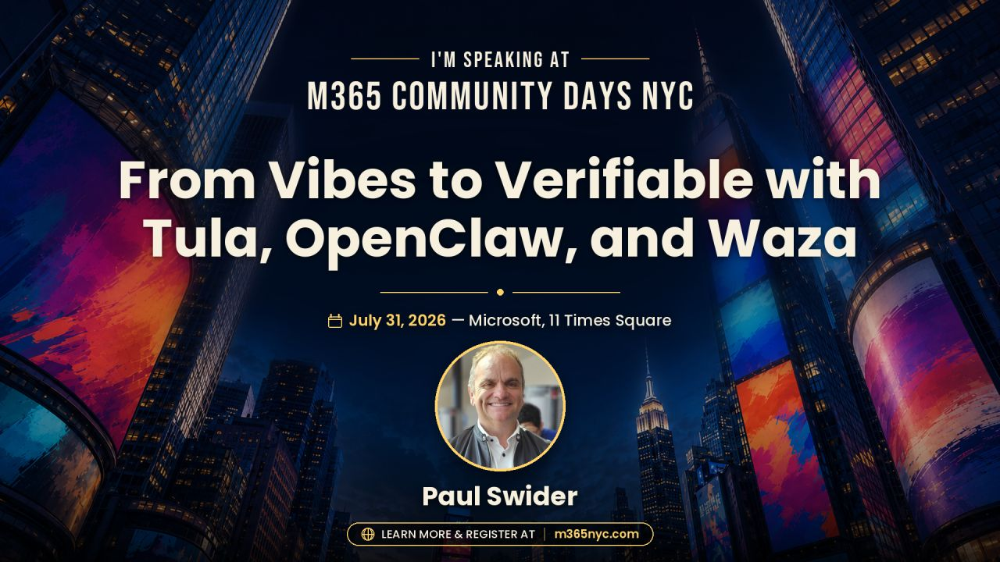

# From Vibes to Verifiable

> A presentation companion for **M365 Community Days NYC 2026**
> **Paul Swider · RealActivity · July 31, 2026**

**[Open the companion site](https://realactivity.github.io/from-vibes-to-verifiable/) ·
[Download the PowerPoint](downloads/From-Vibes-to-Verifiable-M365-NYC-2026.pptx) ·
[Explore Tula](https://github.com/realactivity/tula)**



## The idea

An agent that can act should also be able to show its work.

This repository follows one reusable trust pattern across two very different
agents:

```text
context → runtime → skills → data boundary → evaluations → governance → evidence
```

- **Microsoft Scout** makes the enterprise version visible: an always-on
  Microsoft 365 agent built on OpenClaw and Work IQ, with identity, access
  controls, policy conformance, and human approval for sensitive actions.
- **Tula** applies the same open substrate to personal health. Its skills make
  the agent's responsibilities, boundaries, and failure behavior inspectable.
- **Wren**, inside Tula, is the MIT-licensed SMART on FHIR records relay that
  connects patient-authorized portal data—including Epic endpoints—to the
  `health-records` OpenClaw skill.
- **My Aria** is the patient-facing visual layer for the longitudinal record.
- **Microsoft Waza** turns skill expectations into repeatable evaluation
  evidence.
- **Mellow Mushroom** is a synthetic governance prototype that makes consent,
  attention, policy, and audit visible across the stack.

The punchline is not “trust the demo.” It is:

> **Inspect the contract. Test the behavior. Constrain the action. Audit the result.**

## Start here

| If you are… | Open this |
|---|---|
| Attending the session | [Companion site](https://realactivity.github.io/from-vibes-to-verifiable/) |
| Presenting the session | [Demo runbook](DEMO_RUNBOOK.md) |
| Checking the claims | [Source map](SOURCES.md) |
| Exploring the architecture | [Story and architecture](STORY.md) |
| Looking for the slides | [Download the PowerPoint](downloads/From-Vibes-to-Verifiable-M365-NYC-2026.pptx) |

## The stack in one view

| Layer | Workforce story | Patient story | Evidence question |
|---|---|---|---|
| Context | Work IQ + Microsoft 365 | Patient-owned health workspace | What information did it use? |
| Runtime | OpenClaw | OpenClaw | Where did the action run? |
| Skills | Scout capabilities | Tula health skills | What was it allowed to do? |
| Data bridge | Microsoft 365 connectors | Wren + SMART on FHIR | How did data cross the boundary? |
| Experience | Scout | My Aria | What does the person see? |
| Evaluation | Policy conformance | Waza + Patient Agent Eval Standard | What behavior was tested? |
| Governance | Identity, approval, audit | Consent, escalation, audit | Can we reconstruct the action? |

## Safety and product-status notes

- Tula and My Aria are not medical devices and do not provide medical advice.
- My Aria screenshots in this repository use synthetic fixture data.
- The Mellow Mushroom governance dashboard is a synthetic demonstration, not
  production telemetry.
- Wren is not affiliated with or endorsed by Epic Systems Corporation. Epic,
  MyChart, Tula, Wren, Aria, and RealActivity are trademarks of their
  respective owners.

## Repository map

```text
.
├── index.html                 # GitHub Pages companion
├── styles.css                 # My Aria-inspired visual system
├── script.js                  # Small, dependency-free interactions
├── assets/                    # Project/repository-sourced imagery
├── downloads/                 # Presentation download
├── STORY.md                   # Full narrative and architecture
├── DEMO_RUNBOOK.md            # Live-demo sequence and fallbacks
├── SOURCES.md                 # Primary links and image provenance
└── .github/workflows/pages.yml
```

## Contributing

Corrections, better sources, and clearer explanations are welcome. Please keep
the story evidence-first, protect patient privacy, and avoid adding external
images without documenting provenance in [`SOURCES.md`](SOURCES.md).

---

Built by [RealActivity](https://realactivity.ai) for the people who want
agents to be useful **and** interrogable.
